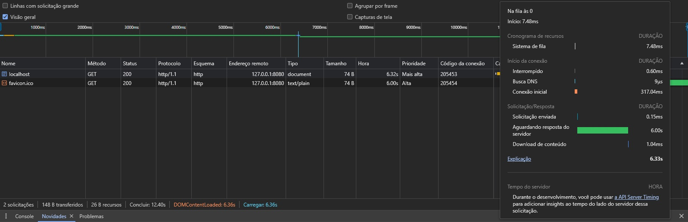
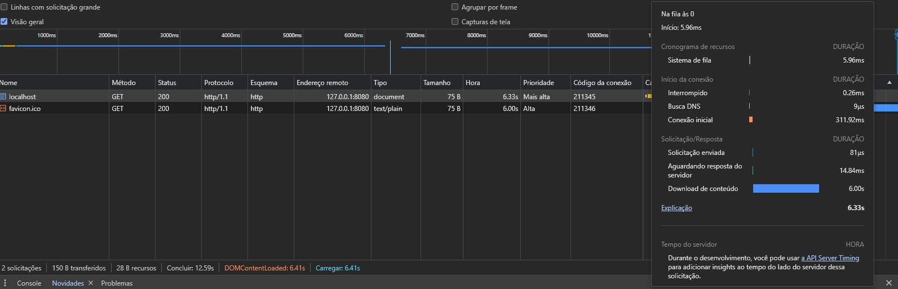

# API em C para Análise de Performance em Nível 1

Este projeto consiste em uma API em C desenvolvida com o propósito de estudar conexões TCP e realizar análises de desempenho de aplicativos de nível 1 usando as ferramentas de desenvolvedor do navegador (DevTools).

## Funcionalidades

- **Server Base**: Implementação básica de um servidor TCP para receber requisições.
- **Slow Processing**: Arquivo que simula um processamento lento de requisições no servidor.
- **Slow Download**: Arquivo que simula uma lentidão na resposta do servidor ao realizar o download de dados.

## Requisitos

- Ambiente Linux
- Compilador de C
- Ambiente de Desenvolvimento C (como GCC)
- Navegador Web para análise de performance (recomendado: Google Chrome com DevTools)

## Como Usar

1. Clone o repositório em sua máquina local:

   ```bash
   git clone https://github.com/seu-usuario/api-c-performance.git
   ```

2. Compile os arquivos utilizando o compilador de C:

   ```bash
   gcc -o server server.c
   gcc -o slow-processing slow-processing.c
   gcc -o slow-download slow-download.c
   ```

3. Execute o servidor base:

   ```bash
   ./server
   ```

4. Em outro terminal, abra um cliente para enviar requisições:

   ```bash
   telnet localhost 8080
   ```

   Você pode enviar diferentes tipos de requisições para testar o desempenho, como:

   ```plaintext
   GET /data HTTP/1.1
   ```

   Após enviar a requisição, você receberá a resposta do servidor.

5. Para simular um processamento lento, execute o arquivo `slow-processing` em paralelo com o servidor:

   ```bash
   ./slow-processing
   ```

   Este processo simula um processamento demorado das requisições.

   

6. Para simular um download lento, execute o arquivo `slow-download` em paralelo com o servidor:

   ```bash
   ./slow-download
   ```

   Este processo simula uma resposta lenta do servidor durante o download de dados.

   

## Exemplo de Análise de Performance

Você pode utilizar as ferramentas de desenvolvedor do navegador (como o Google Chrome DevTools) para analisar o desempenho da aplicação em diferentes cenários. Por exemplo, você pode medir o tempo de resposta das requisições, identificar gargalos de processamento e otimizar o código conforme necessário.

